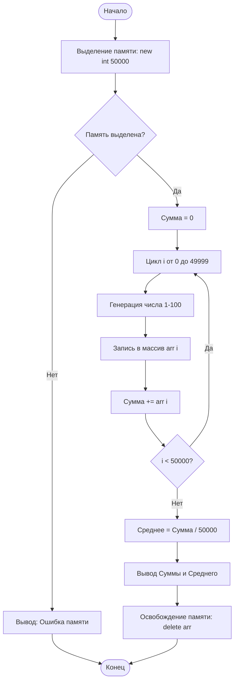
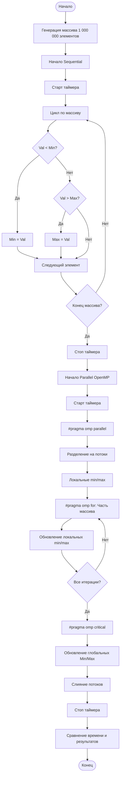
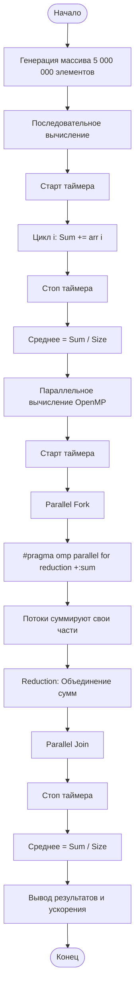

# Задание 1: Основы C++ и OpenMP

В этом репозитории содержатся решения для Задания 1, демонстрирующие динамическое управление памятью и распараллеливание с помощью OpenMP на C++.

## Структура проекта

- `task1.cpp`: Динамическое выделение массива, заполнение случайными числами, вычисление среднего значения.
- `task2_3.cpp`: Последовательный и параллельный (OpenMP) поиск минимума и максимума (1 млн элементов).
- `task4.cpp`: Последовательное и параллельное (OpenMP Reduction) вычисление среднего значения (5 млн элементов).
- `README.md`: этот файл.

## Компиляция и запуск

Убедитесь, что у вас установлен компилятор C++ с поддержкой OpenMP (например, GCC, Clang, MSVC).

### Компиляция
```bash
# Задание 1
g++ task1.cpp -o task1

# Задания 2 и 3
g++ -fopenmp task2_3.cpp -o task2_3

# Задание 4
g++ -fopenmp task4.cpp -o task4
```

### Запуск
```bash
./task1
./task2_3
./task4
```

---

## Контрольные вопросы (Ответы)

1.  **В чём отличие динамического массива от статического массива в языке C++?**
    *   **Статический**: Размер фиксируется на этапе компиляции, выделяется в стеке. Память управляется автоматически.
    *   **Динамический**: Размер определяется во время выполнения, выделяется в куче (используя `new` или `malloc`). Должен быть освобожден вручную (используя `delete[]` или `free`), чтобы избежать утечек.

2.  **Что такое указатель и зачем он используется при работе с динамической памятью?**
    *   Указатель — это переменная, хранящая адрес памяти другой переменной. Оператор `new` возвращает адрес выделенного блока в куче, поэтому нам нужен указатель для хранения этого адреса и доступа к динамической памяти.

3.  **Почему важно корректно освобождать память после использования динамических массивов?**
    *   Динамическая память не освобождается автоматически (в C/C++). Если ее не освободить, это приведет к **утечке памяти**, когда программа потребляет все больше и больше ОЗУ, пока система не исчерпает ресурсы или программа не завершится аварийно.

4.  **В чём разница между последовательной и параллельной обработкой массива?**
    *   **Последовательная**: Инструкции выполняются одна за другой на одном ядре процессора.
    *   **Параллельная**: Несколько инструкций выполняются одновременно на нескольких ядрах/потоках процессора, что потенциально ускоряет выполнение.

5.  **Что делает директива `#pragma omp parallel for`?**
    *   Это директива OpenMP, которая создает команду потоков и разделяет итерации следующего за ней цикла `for` между ними, так что итерации цикла выполняются параллельно.

6.  **Для чего используется механизм reduction в OpenMP?**
    *   Он безопасно объединяет частичные результаты, вычисленные каждым потоком, в одну общую переменную (например, суммирование чисел). Он автоматически обрабатывает "гонки данных".

7.  **Почему при параллельном вычислении суммы необходимо использовать reduction, а не обычную переменную?**
    *   Без reduction несколько потоков пытались бы записывать в переменную `sum` одновременно (состояние гонки), что привело бы к некорректным результатам. Атомарные операции безопаснее, но медленнее; reduction оптимизирован для таких задач.

8.  **Какие факторы могут привести к тому, что параллельная версия программы будет работать медленнее последовательной?**
    *   **Накладные расходы (Overhead)**: Создание/управление потоками занимает время. Если задача слишком мала, накладные расходы превысят время вычислений.
    *   **Ложное разделение (False Sharing)**: Потоки обновляют переменные, находящиеся на одной кэш-линии.
    *   **Критические секции/Блокировки**: Слишком долгое ожидание общих ресурсов.
    *   **Пропускная способность памяти**: Насыщение шины данных, если все ядра запрашивают данные одновременно.

---

## Блок-схемы (Flowcharts)

### Задание 1: Динамический массив и Среднее значение



### Задания 2 и 3: Поиск Мин/Макс (Послед. vs Параллельно)



### Задание 4: Вычисление Среднего (Послед. vs Параллельно)


