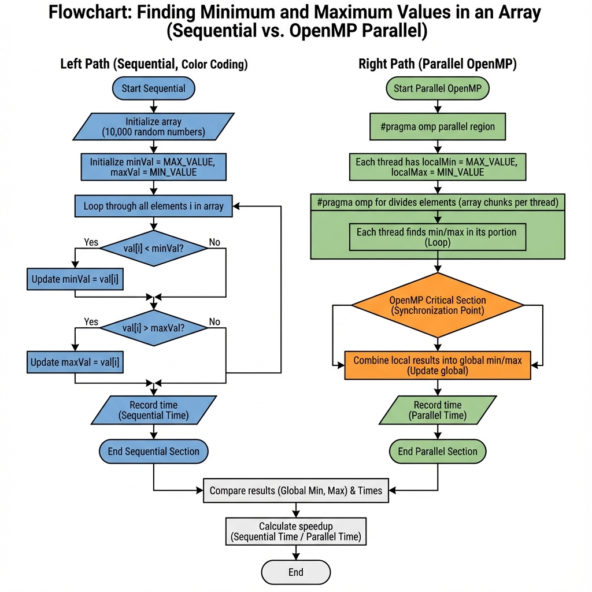
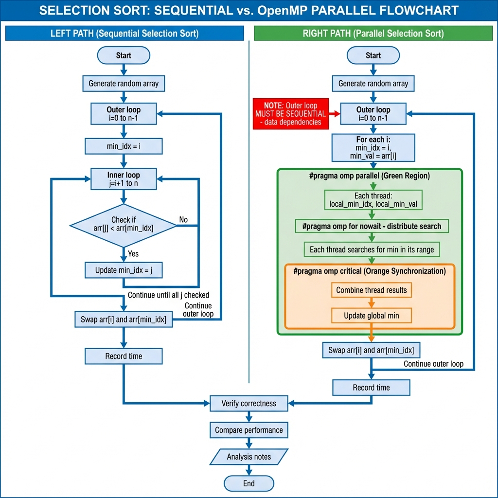
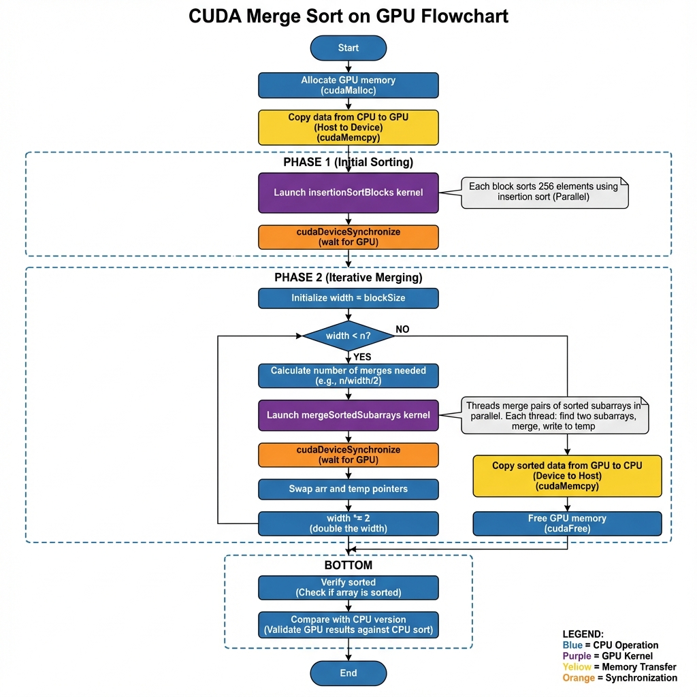

# Задание 2: Гетерогенная параллелизация

Этот репозиторий содержит решения для Задания 2, демонстрирующие концепции гетерогенной параллелизации с использованием OpenMP и CUDA.

## Структура проекта

- [task2.cpp](file:///c:/Users/Aibol/Desktop/AITU/2nd%20course/2nd%20trimester/heterogeneous-parallelization/ass2/task2.cpp): Поиск мин/макс значений с OpenMP (10,000 элементов)
- [task3.cpp](file:///c:/Users/Aibol/Desktop/AITU/2nd%20course/2nd%20trimester/heterogeneous-parallelization/ass2/task3.cpp): Сортировка выбором с OpenMP (1,000 и 10,000 элементов)
- [task4.cu](file:///c:/Users/Aibol/Desktop/AITU/2nd%20course/2nd%20trimester/heterogeneous-parallelization/ass2/task4.cu): CUDA сортировка слиянием на GPU (10,000 и 100,000 элементов)
- `README.md`: Этот файл
- `screenshots/`: Директория для скриншотов вывода программ

## Компиляция и запуск

### Требования

- **Компилятор C++** с поддержкой OpenMP (GCC, Clang, или MSVC)
- **NVIDIA CUDA Toolkit** (для Задания 4) - Скачать с [NVIDIA CUDA Downloads](https://developer.nvidia.com/cuda-downloads)
- **NVIDIA GPU** (для запуска Задания 4)
- **Visual Studio Build Tools** (для Windows + CUDA)

### Компиляция

```bash
# Задание 2: Поиск мин/макс
g++ -fopenmp task2.cpp -o task2

# Задание 3: Сортировка выбором
g++ -fopenmp task3.cpp -o task3

# Задание 4: CUDA сортировка слиянием (требует CUDA Toolkit)
nvcc task4.cu -o task4
```

> **Примечание для Windows:** Для компиляции CUDA используйте **Developer Command Prompt for Visual Studio**

### Запуск

```bash
./task2
./task3
./task4
```

---

## Задание 1: Введение в гетерогенную параллелизацию

### Что такое гетерогенная параллелизация?

**Гетерогенная параллелизация** - это подход к вычислениям, который объединяет различные типы процессоров (обычно CPU и GPU) для выполнения программы. Каждый тип процессора обрабатывает задачи, для которых он наиболее подходит, обеспечивая оптимальную производительность и энергоэффективность.

### Различия между параллельными вычислениями на CPU и GPU

| Аспект | CPU | GPU |
|--------|-----|-----|
| **Архитектура** | Несколько мощных ядер (4-32) | Тысячи простых ядер (1000+) |
| **Философия дизайна** | Низкая задержка, сложный поток управления | Высокая пропускная способность, массивный параллелизм |
| **Лучше всего для** | Последовательные задачи, ветвление логики | Параллельные по данным задачи, SIMD операции |
| **Память** | Большая иерархия кэша | Меньший кэш, высокая пропускная способность VRAM |
| **Переключение контекста** | Быстрое и эффективное | Дорогостоящее |
| **Производительность одного потока** | Очень высокая | Ниже |

### Преимущества гетерогенной параллелизации

1. **Оптимизация производительности**: Каждая задача выполняется на наиболее подходящем процессоре
2. **Энергоэффективность**: GPU могут выполнять определенные задачи с лучшим соотношением производительность/ватт
3. **Балансировка нагрузки**: Распределение работы на основе сильных сторон оборудования
4. **Экономическая эффективность**: Лучшее использование существующего оборудования
5. **Масштабируемость**: Объединение ресурсов с различных типов устройств

### Примеры реальных приложений

#### 1. Машинное обучение и ИИ
- **CPU**: Предобработка данных, решения об архитектуре модели, операции ввода-вывода
- **GPU**: Умножение матриц, обучение нейронных сетей, вывод

#### 2. Научные вычисления
- **CPU**: Настройка задачи, анализ результатов, поток управления
- **GPU**: Вычислительные ядра (например, симуляции молекулярной динамики)

#### 3. Обработка видео
- **CPU**: Файловый ввод-вывод, выбор кодека, планирование
- **GPU**: Кодирование/декодирование видео, фильтры, рендеринг

#### 4. Финансовое моделирование
- **CPU**: Бизнес-логика, алгоритмы управления рисками
- **GPU**: Симуляции Монте-Карло, ценообразование опционов

#### 5. Криптография и безопасность
- **CPU**: Управление ключами, обработка протоколов
- **GPU**: Вычисление хешей, обнаружение взлома паролей

---

## Задание 2: Поиск мин/макс с OpenMP

### Блок-схема



### Анализ производительности

Параллельная версия обычно показывает умеренное ускорение для этой задачи, потому что:
- Операция ограничена памятью (чтение 10,000 целых чисел)
- Минимальные вычисления на элемент (только сравнения)
- Накладные расходы OpenMP могут быть значительными для таких простых операций

---

## Задание 3: Сортировка выбором с OpenMP

### Блок-схема



### Почему ограниченная параллелизация?

Сортировка выбором имеет **присущие последовательные зависимости**:
1. Внешний цикл не может быть распараллелен (каждая итерация зависит от предыдущей)
2. Может быть распараллелен только шаг поиска минимума (внутренний цикл)
3. Для небольших массивов накладные расходы OpenMP превышают выгоду
4. Существуют лучшие алгоритмы для параллельной сортировки (сортировка слиянием, быстрая сортировка)

---

## Задание 4: CUDA сортировка слиянием на GPU

### Блок-схема



### Алгоритм CUDA сортировки слиянием

1. **Начальная сортировка**: Каждый GPU блок сортирует небольшую часть (256 элементов) используя сортировку вставками
2. **Итеративное слияние**: Повторно сливаем отсортированные подмассивы
   - Начинаем с подмассивов размером 256
   - На каждой итерации сливаем пары смежных отсортированных подмассивов
   - Удваиваем размер подмассива на каждой итерации
   - Продолжаем, пока весь массив не отсортирован
3. **Параллелизм**: Множественные слияния происходят одновременно на разных GPU потоках

### Соображения производительности

- **Накладные расходы передачи памяти**: Передача данных CPU↔GPU может быть узким местом
- **Размер блока**: 256 элементов на блок балансирует рабочую нагрузку и использование ресурсов
- **Конфигурация сетки**: Количество блоков/потоков влияет на использование GPU
- **Размер задачи**: Большие массивы показывают лучшее ускорение GPU из-за лучшего использования параллелизма

---

## Контрольные вопросы (Ответы)

### 1. Что понимается под гетерогенной параллелизацией?

Гетерогенная параллелизация - это парадигма вычислений, которая использует различные типы процессоров (обычно CPU и GPU) вместе в одной системе. Каждый процессор обрабатывает задачи, подходящие для его архитектуры, максимизируя общую производительность и эффективность системы.

### 2. В чём принципиальные различия архитектур CPU и GPU?

| Особенность | CPU | GPU |
|-------------|-----|-----|
| Количество ядер | Мало (4-32) мощных ядер | Тысячи простых ядер |
| Цель дизайна | Минимизировать задержку | Максимизировать пропускную способность |
| Кэш | Большой, многоуровневый кэш | Меньший кэш, фокус на пропускной способности |
| Поток управления | Сложное предсказание ветвлений | Простое управление, штраф за расхождение |
| Память | DDR (меньшая пропускная способность) | GDDR/HBM (высокая пропускная способность) |
| Потоки | Тяжеловесные потоки | Легковесные потоки |

### 3. Какие типы задач лучше подходят для выполнения на GPU, а какие — на CPU?

**Задачи, подходящие для GPU:**
- Высокий параллелизм по данным (одна операция на множестве точек данных)
- Регулярные паттерны доступа к памяти
- Высокая арифметическая интенсивность (много операций на элемент данных)
- Примеры: Матричные операции, обработка изображений, симуляции

**Задачи, подходящие для CPU:**
- Сложный поток управления (много if/else, ветвлений)
- Последовательные зависимости
- Большой объем памяти, требующий кэша
- Низкий параллелизм
- Примеры: Запросы к базам данных, парсеры, деревья решений

### 4. Почему не все алгоритмы эффективно распараллеливаются с использованием OpenMP?

Несколько причин:
1. **Последовательные зависимости**: Некоторые шаги должны завершиться перед другими (например, внешний цикл сортировки выбором)
2. **Накладные расходы синхронизации**: Критические секции и барьеры замедляют выполнение
3. **Дисбаланс нагрузки**: Неравномерное распределение работы оставляет ядра простаивающими
4. **Пропускная способность памяти**: Параллельные потоки конкурируют за доступ к памяти
5. **Малый размер задачи**: Накладные расходы OpenMP превышают выгоду для крошечных рабочих нагрузок
6. **Дизайн алгоритма**: Некоторые алгоритмы по своей природе последовательны (например, итеративное уточнение)

### 5. В чём заключается основная идея алгоритма сортировки слиянием?

Сортировка слиянием следует стратегии **разделяй и властвуй**:
1. **Разделяй**: Разбить массив на две половины
2. **Властвуй**: Рекурсивно отсортировать каждую половину
3. **Объединяй**: Слить две отсортированные половины в один отсортированный массив

Ключевой шаг - слияние: имея два отсортированных массива, мы можем эффективно создать один отсортированный массив, повторно беря меньший из двух передних элементов.

**Временная сложность**: O(n log n) - оптимально для сортировок на основе сравнения  
**Пространственная сложность**: O(n) - требуется временный массив для слияния

### 6. Какие сложности возникают при реализации сортировки слиянием на GPU?

1. **Накладные расходы передачи памяти**: Копирование данных между CPU и GPU может быть дорогостоящим
2. **Рекурсия**: GPU плохо справляются с глубокой рекурсией; нужна итеративная реализация
3. **Распределение работы**: Нужно тщательно балансировать рабочую нагрузку между тысячами потоков
4. **Синхронизация**: Слияние требует координации между потоками
5. **Паттерны доступа к памяти**: Нужно обеспечить согласованный доступ к памяти для эффективности
6. **Расхождение**: Если потоки идут по разным путям кода, эффективность GPU падает
7. **Размер блока/сетки**: Выбор оптимальной конфигурации нетривиален

### 7. Как выбор размера блока и сетки влияет на производительность вычислений на GPU?

**Размер блока (потоков на блок):**
- Слишком маленький: Недоиспользует ядра GPU, плохая заполненность
- Слишком большой: Может превысить лимиты ресурсов (регистры, разделяемая память)
- Оптимально: Обычно 128-512 потоков на блок, в зависимости от ядра

**Размер сетки (количество блоков):**
- Слишком мало: Оставляет ядра GPU простаивающими
- Слишком много: Может превысить лимиты GPU
- Оптимально: Как минимум столько блоков, сколько потоковых мультипроцессоров (SM)

**Общие рекомендации:**
- Максимизировать заполненность (активные потоки vs возможные потоки)
- Обеспечить достаточно блоков для скрытия задержки памяти
- Использовать кратные размеру warp (32 потока)
- Профилировать и настраивать для конкретной архитектуры GPU

### 8. Почему гетерогенный подход может быть эффективнее использования только CPU или только GPU?

Гетерогенный подход использует сильные стороны обоих:

1. **Специализация задач**: Назначать каждую задачу наиболее подходящему процессору
   - CPU: Поток управления, ввод-вывод, последовательные задачи
   - GPU: Параллельные по данным ядра, вычисления

2. **Одновременное выполнение**: CPU и GPU могут работать параллельно на разных частях задачи

3. **Лучшее использование ресурсов**: Оба процессора остаются занятыми вместо простоя одного

4. **Энергоэффективность**: GPU часто обеспечивают лучшее соотношение производительность/ватт для параллельных задач

5. **Гибкость**: Можно динамически адаптироваться к изменяющимся рабочим нагрузкам

6. **Экономическая эффективность**: Максимизирует ценность существующего оборудования

**Пример**: При обработке видео, CPU обрабатывает файловый ввод-вывод и решения декодирования, в то время как GPU выполняет фактические преобразования кадров. Ни один из них в одиночку не был бы настолько эффективен.

---

## Скриншоты

> **Примечание**: Этот раздел должен содержать скриншоты выводов программ. Запустите каждое задание и сделайте скриншот вывода терминала, показывающего:
> - Задание 2: Сравнение производительности между последовательным и параллельным поиском мин/макс
> - Задание 3: Время сортировки выбором для обоих размеров массива
> - Задание 4: Производительность GPU vs CPU сортировки слиянием (если доступна CUDA)

*Поместите ваши скриншоты в директорию `screenshots/` и сделайте ссылки на них здесь.*

Пример структуры:
```markdown
### Вывод Задания 2


### Вывод Задания 3


### Вывод Задания 4

```

---

## Дополнительные примечания

### Для Задания 4 (CUDA)

Если у вас не установлена CUDA или нет GPU NVIDIA:
1. Код предоставлен для образовательных целей
2. Вы можете изучить алгоритм и концепции CUDA
3. Для фактического запуска вам потребуется:
   - GPU NVIDIA (серии GTX/RTX или Tesla)
   - Установленный CUDA Toolkit
   - Совместимый драйвер NVIDIA
   - Visual Studio Build Tools (для Windows)

### Советы по производительности

1. **OpenMP**: Установите количество потоков с помощью переменной окружения (например, `set OMP_NUM_THREADS=8`)
2. **Оптимизация компилятора**: Добавьте флаг `-O3` для лучшей производительности
3. **CUDA**: Экспериментируйте с различными размерами блоков для оптимального использования GPU

---

## Ссылки

- [Официальная документация OpenMP](https://www.openmp.org/)
- [Руководство по программированию NVIDIA CUDA](https://docs.nvidia.com/cuda/cuda-c-programming-guide/)
- [Гетерогенные вычисления с OpenCL](https://www.khronos.org/opencl/)
