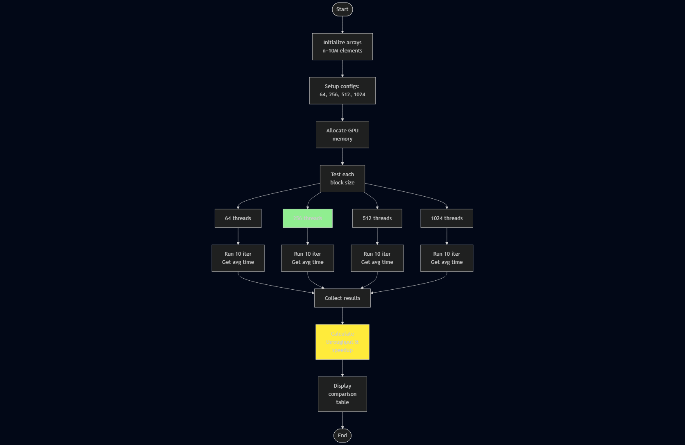

# Assignment 3: Архитектура GPU и оптимизация CUDA-программ

Этот модуль содержит решения заданий по исследованию архитектуры GPU, типов памяти CUDA и оптимизации параллельных программ.

## Структура проекта

- [task1.cu](file:///c:/Users/Aibol/Desktop/AITU/2nd%20course/2nd%20trimester/heterogeneous-parallelization/ass3/task1.cu): Сравнение глобальной и разделяемой памяти (1,000,000 элементов)
- [task2.cu](file:///c:/Users/Aibol/Desktop/AITU/2nd%20course/2nd%20trimester/heterogeneous-parallelization/ass3/task2.cu): Влияние размера блока на производительность (10,000,000 элементов)
- [task3.cu](file:///c:/Users/Aibol/Desktop/AITU/2nd%20course/2nd%20trimester/heterogeneous-parallelization/ass3/task3.cu): Коалесцированный vs некоалесцированный доступ к памяти (1,000,000 элементов)
- [task4.cu](file:///c:/Users/Aibol/Desktop/AITU/2nd%20course/2nd%20trimester/heterogeneous-parallelization/ass3/task4.cu): Оптимизация конфигурации сетки и блоков (матричное умножение 1024×1024)
- `README.md`: Этот файл
- `images/`: Директория с блок-схемами

## Компиляция и запуск

### Требования

- **NVIDIA CUDA Toolkit** (версия 10.0+) - [Скачать здесь](https://developer.nvidia.com/cuda-downloads)
- **NVIDIA GPU** с compute capability 3.0+
- **Компилятор**: nvcc (входит в CUDA Toolkit)
- **Visual Studio Build Tools** (для Windows)

### Компиляция

```bash
# Задание 1: Глобальная vs Разделяемая память
nvcc task1.cu -o task1

# Задание 2: Влияние размера блока
nvcc task2.cu -o task2

# Задание 3: Паттерны доступа к памяти
nvcc task3.cu -o task3

# Задание 4: Оптимизация конфигурации
nvcc task4.cu -o task4
```

> **Примечание для Windows PowerShell:** Используйте `.\task1.exe` для запуска

### Запуск

```bash
# Windows
.\task1.exe
.\task2.exe
.\task3.exe

# Linux/Mac
./task1
./task2
./task3
```

---

## Задание 1: Глобальная vs Разделяемая память

### Блок-схема


### Описание

Реализация двух версий поэлементного умножения массива на константу:

1. **Версия с глобальной памятью**: Все операции выполняются напрямую с глобальной памятью GPU
2. **Версия с разделяемой памятью**: Данные загружаются в shared memory для ускорения

### Теория: Иерархия памяти CUDA

| Тип памяти | Задержка | Пропускная способность | Scope |
|-----------|---------|----------------------|-------|
| **Регистры** | 1 цикл | Максимальная | Поток |
| **Shared Memory** | ~5 циклов | Очень высокая | Блок |
| **L1/L2 Cache** | ~30 циклов | Высокая | SM/GPU |
| **Global Memory** | 400-800 циклов | Средняя | Все потоки |

### Когда использовать Shared Memory?

- ✅ Повторный доступ к одним и тем же данным
- ✅ Обмен данными между потоками блока
- ✅ Сложные вычисления на локальных данных
- ✅ Редукция внутри блока

### Анализ результатов

Для простых поэлементных операций shared memory может не показывать преимущества из-за overhead загрузки/выгрузки данных. Однако для более сложных алгоритмов (матричное умножение, свертки, редукция) выигрыш существенный.

---

## Задание 2: Влияние размера блока

### Блок-схема



### Описание

Исследование влияния размера блока потоков (threads per block) на производительность поэлементного сложения массивов. Тестируются размеры: **64, 256, 512, 1024** потоков на блок.

### Теория: Occupancy и размер блока

**Occupancy** = (Активные warps) / (Максимальные warps на SM)

Факторы, влияющие на occupancy:
- Количество потоков на блок
- Использование регистров на поток
- Объем shared memory на блок
- Максимальные ресурсы SM

### Что такое Warp?

- **Warp** = группа из 32 потоков, выполняемых одновременно
- GPU выполняет инструкции на уровне warp, а не отдельных потоков
- Размер блока должен быть кратен 32 для эффективности

### Оптимальные размеры блоков

| Архитектура GPU | Рекомендуемый размер | Максимум |
|----------------|---------------------|----------|
| Fermi/Kepler | 128-256 | 1024 |
| Maxwell/Pascal | 256-512 | 1024 |
| Volta/Turing | 256-512 | 1024 |
| Ampere/Ada | 256-512 | 1024 |

### Key Insights

1. **Слишком маленькие блоки** (< 128): Низкий occupancy, недоиспользование GPU
2. **Слишком большие блоки** (> 512): Риск превышения лимитов регистров/shared memory
3. **Оптимальный диапазон**: 256-512 для большинства современных GPU
4. **Всегда профилируйте** на целевом железе!

---

## Задание 3: Паттерны доступа к памяти

### Блок-схема


### Описание

Демонстрация критического влияния паттернов доступа к глобальной памяти на производительность. Сравниваются три подхода:

1. **Coalesced access** (stride = 1): Последовательный доступ
2. **Non-coalesced access** (stride = 32): Разреженный доступ
3. **Reverse access**: Обратный порядок

### Что такое Memory Coalescing?

Когда потоки в warp обращаются к последовательным адресам памяти, GPU объединяет эти обращения в **одну транзакцию памяти**. Это критически важно для производительности!

```
✅ Коалесцированный доступ (эффективно):
Thread:  0    1    2    3  ...  31
Memory: [0]  [1]  [2]  [3] ... [31]  ← Одна транзакция!

❌ Некоалесцированный доступ (неэффективно):
Thread:  0     1     2     3   ...   31
Memory: [0]  [32]  [64]  [96] ... [992]  ← 32 транзакции!
```

### Memory Transaction Efficiency

**Эффективность** = (Запрошенные байты) / (Загруженные байты) × 100%

| Паттерн доступа | Эффективность | Относительная скорость |
|----------------|---------------|----------------------|
| Sequential (stride 1) | ~100% | 1.0x ⭐ |
| Reverse order | ~50-80% | 0.8-0.9x |
| Stride 32 | ~3-6% | 0.03-0.1x ❌ |

### Best Practices

✅ **DO:**
- Используйте последовательный доступ к памяти
- Структура массивов (SoA) вместо массива структур (AoS)
- Выравнивайте данные по границам cache line
- Профилируйте с NVIDIA Nsight

❌ **DON'T:**
- Случайный доступ к памяти
- Большие strides между обращениями
- Невыровненные структуры данных

---

## Задание 4: Оптимизация конфигурации

### Блок-схема


### Описание

Подбор оптимальных параметров конфигурации сетки и блоков потоков на примере матричного умножения. Сравниваются:

1. **Non-optimal**: 8×8 блоки (64 потока)
2. **Improved**: 16×16 блоки (256 потоков)
3. **Optimized**: 16×16 блоки + shared memory tiling

### Факторы оптимизации

| Параметр | Влияние |
|----------|---------|
| **Block size** | Occupancy, resource usage |
| **Shared memory** | Memory bandwidth, reuse |
| **Warp alignment** | Execution efficiency |
| **Register usage** | Threads per SM |

### Результаты оптимизации

- **8×8 blocks**: Низкий occupancy (~25%), плохая утилизация GPU
- **16×16 blocks**: Хороший occupancy (~50-75%), сбалансированная производительность
- **16×16 + Shared**: Optimal - минимизация глобальной памяти, максимальная производительность

**Типичное ускорение**: 3-10x от неоптимальной к оптимизированной конфигурации

---

## Контрольные вопросы

### 1. Какие основные типы памяти существуют в архитектуре CUDA?

- **Регистры**: Самая быстрая память, локальная для каждого потока
- **Shared Memory**: Быстрая память, разделяемая между потоками блока (on-chip)
- **Local Memory**: Память потока в глобальной памяти (медленная)
- **Global Memory**: Основная память GPU, доступна всем потокам
- **Constant Memory**: Read-only кэшируемая память
- **Texture Memory**: Специализированная кэшируемая память

**Скорость доступа**: Регистры > Shared > L1/L2 Cache > Global/Local

### 2. В каких случаях использование разделяемой памяти ускоряет программу?

- Повторное чтение одних и тех же данных внутри блока
- Обмен данными между потоками (например, редукция)
- Блочные алгоритмы (матричное умножение, свертки)
- Кэширование часто используемых данных
- Алгоритмы с высокой локальностью данных

### 3. Как шаблон доступа к глобальной памяти влияет на производительность?

**Коалесцированный доступ** (последовательный):
- Все обращения warp объединяются в одну транзакцию
- Максимальная пропускная способность памяти
- Высокая эффективность использования cache

**Некоалесцированный доступ** (разреженный):
- Множество отдельных транзакций памяти
- Низкая пропускная способность
- Падение производительности в 5-30 раз!

### 4. Почему одинаковый алгоритм на GPU показывает разное время при разных способах обращения к памяти?

- GPU архитектура оптимизирована для последовательного доступа
- Memory controller объединяет транзакции только для coalesced доступа
- Cache lines (128 bytes) загружаются целиком
- При разреженном доступе загружается много неиспользуемых данных
- Эффективность использования пропускной способности падает

### 5. Как размер блока потоков влияет на производительность?

**Маленький размер блока** (< 128):
- Низкий occupancy
- Недоиспользование вычислительных ресурсов
- Больше overhead на запуск блоков

**Большой размер блока** (> 512):
- Может превысить лимиты ресурсов
- Меньше блоков → хуже скрытие латентности
- Риск недостаточности регистров/shared memory

**Оптимальный размер** (256-512):
- Баланс между occupancy и ресурсами
- Достаточно warps для скрытия латентности
- Эффективное использование SM

### 6. Что такое варп и почему важно учитывать его при разработке?

**Warp** - группа из 32 потоков, выполняемых SIMT (Single Instruction, Multiple Threads).

**Почему важен:**
- GPU выполняет инструкции на уровне warp
- Все потоки warp выполняют одну инструкцию одновременно
- Divergence (ветвление) внутри warp вызывает сериализацию
- Memory coalescing происходит на уровне warp
- Размер блока должен быть кратен 32

**Best practices:**
- Размер блока = n × 32 (например, 64, 128, 256, 512)
- Минимизировать divergence (if/else) внутри warp
- Учитывать warp при оптимизации доступа к памяти

### 7. Какие факторы учитывать при выборе конфигурации сетки и блоков?

1. **Размер данных**: Обеспечить достаточно потоков для обработки
2. **Occupancy**: Максимизировать активные warps на SM
3. **Ресурсы**: Регистры, shared memory, константная память
4. **Compute Capability**: Возможности конкретного GPU
5. **Паттерн доступа**: Оптимизация для coalesced доступа
6. **Балансировка нагрузки**: Равномерное распределение работы

### 8. Почему оптимизация часто начинается с анализа работы с памятью?

- **Memory-bound задачи**: Большинство kernel ограничены пропускной способностью памяти, а не вычислениями
- **Латентность памяти**: Глобальная память в 100-200 раз медленнее арифметики
- **Закон Амдала**: Узкое место определяет общую производительность
- **Bandwidth utilization**: Часто используется < 50% доступной пропускной способности
- **Быстрые улучшения**: Оптимизация памяти дает наибольший эффект

**Типичный профиль оптимизации:**
1. Анализ памяти (coalescing, bandwidth)
2. Использование shared memory
3. Оптимизация occupancy
4. Алгоритмическая оптимизация

---

## Дополнительные ресурсы

- [NVIDIA CUDA Programming Guide](https://docs.nvidia.com/cuda/cuda-c-programming-guide/)
- [CUDA Best Practices Guide](https://docs.nvidia.com/cuda/cuda-c-best-practices-guide/)
- [NVIDIA Nsight Compute](https://developer.nvidia.com/nsight-compute) - Профилировщик
- [CUDA Samples](https://github.com/NVIDIA/cuda-samples)

---

## Советы по производительности

1. **Всегда профилируйте!** Используйте NVIDIA Nsight для анализа
2. **Memory coalescing** - первый приоритет оптимизации
3. **Shared memory** - используйте для данных с повторным доступом
4. **Occupancy** - стремитесь к 50-75% (100% не всегда нужно)
5. **Warp divergence** - минимизируйте ветвления в пределах warp

---

**Автор**: Heterogeneous Parallelization Course  
**Дата**: 2026
