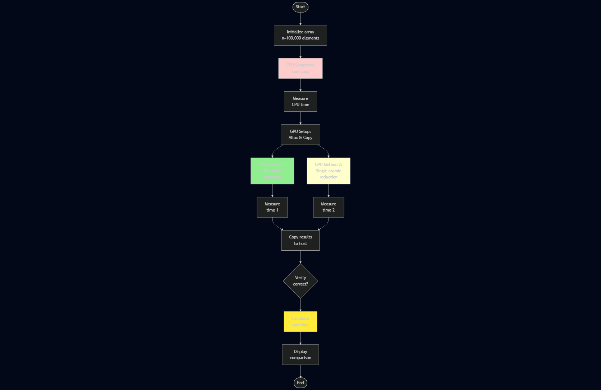
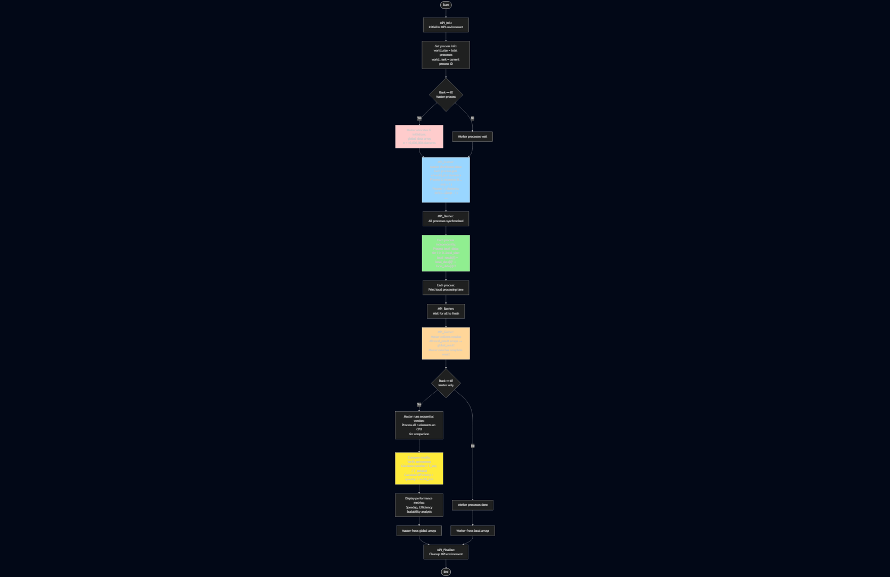

# Assignment 4: Гибридные и распределённые параллельные вычисления

Этот модуль демонстрирует концепции гибридных вычислений, сравнение CPU и GPU подходов к параллельной обработке данных.

## Структура проекта

- [task1.cu](file:///c:/Users/Aibol/Desktop/AITU/2nd%20course/2nd%20trimester/heterogeneous-parallelization/ass4/task1.cu): Вычисление суммы массива - CPU vs GPU (100,000 элементов)
- [task2.cu](file:///c:/Users/Aibol/Desktop/AITU/2nd%20course/2nd%20trimester/heterogeneous-parallelization/ass4/task2.cu): Префиксная сумма с shared memory (1,000,000 элементов)
- [task3.cu](file:///c:/Users/Aibol/Desktop/AITU/2nd%20course/2nd%20trimester/heterogeneous-parallelization/ass4/task3.cu): Гибридная CPU+GPU обработка (10,000,000 элементов)
- [task4.cpp](file:///c:/Users/Aibol/Desktop/AITU/2nd%20course/2nd%20trimester/heterogeneous-parallelization/ass4/task4.cpp): MPI распределенная обработка (10,000,000 элементов)
- `README.md`: Этот файл
- `images/`: Директория с блок-схемами

## Компиляция и запуск

### Требования

- **NVIDIA CUDA Toolkit** (версия 10.0+)
- **NVIDIA GPU** с поддержкой CUDA
- **Компилятор C++** с поддержкой C++11
- **MPI Implementation** (для Task 4): Microsoft MPI или MPICH

### Компиляция

```bash
# Задание 1: Редукция массива
nvcc task1.cu -o task1

# Задание 2: Префиксная сумма
nvcc task2.cu -o task2

# Задание 3: Гибридная обработка
nvcc task3.cu -o task3

# Задание 4: MPI (требует MPI установку)
# Windows: используйте Microsoft MPI
mpicxx task4.cpp -o task4
# Linux: 
# mpic++ task4.cpp -o task4
```

### Запуск

```bash
# Windows
.\task1.exe

# Linux/Mac
./task1
```

---

## Задание 1: Редукция массива (Сумма элементов)

### Блок-схема



### Описание

Сравнение производительности вычисления суммы элементов массива между CPU (последовательная реализация) и GPU (параллельная реализация с глобальной памятью).

**Реализовано два метода на GPU:**

1. **Two-Stage Reduction**: Двухэтапная редукция с частичными суммами
2. **Single-Stage Reduction**: Одноэтапная редукция с atomic operations

### Теория: Редукция на GPU

**Редукция** - операция сведения множества значений к одному (sum, max, min, etc.)

```
Входные данные: [1, 2, 3, 4, 5, 6, 7, 8]
Редукция (сумма): 36

Параллельный подход (tree reduction):
Уровень 0: [1, 2, 3, 4, 5, 6, 7, 8]
Уровень 1:  [3,   7,   11,  15]      ← Попарная сумма
Уровень 2:     [10,      26]         ← Попарная сумма
Уровень 3:          [36]             ← Финальный результат
```

### Челленджи GPU редукции

1. **Синхронизация**: Потоки должны координироваться
2. **Atomic operations**: Создают contention при записи в общую переменную
3. **Memory bandwidth**: Может стать узким местом
4. **Divergence**: Количество активных потоков уменьшается на каждом уровне

### CPU vs GPU Trade-offs

| Характеристика | CPU Sequential | GPU Parallel |
|---------------|----------------|--------------|
| **Сложность кода** | Простой | Сложнее |
| **Малые данные** | Быстрее | Overhead |
| **Большие данные** | Медленнее | Быстрее |
| **Memory transfer** | N/A | Overhead CPU↔GPU |
| **Предсказуемость** | Высокая | Зависит от hardware |

### Когда использовать GPU?

✅ **Используйте GPU когда:**
- Размер данных > 1 миллион элементов
- Множественные редукции в pipeline
- Данные уже на GPU
- Сложные операции на элемент

❌ **Избегайте GPU когда:**
- Малый размер данных (< 10,000)
- Однократная операция
- Критична предсказуемость времени
- CPU already optimal

---

## Задание 2: Префиксная сумма (Scan)

### Блок-схема


### Описание

Реализация параллельного алгоритма префиксной суммы (scan) с использованием shared memory. Используется алгоритм Hillis-Steele.

**Пример работы:**
```
Input:  [3, 1, 7, 0, 4, 1, 6, 3]
Output: [3, 4,11,11,15,16,22,25]  (накопленная сумма)
```

### Челленджи

- Сильные последовательные зависимости
- Работа O(n log n) против CPU O(n)
- Многоблочная координация
- Требуется синхронизация

---

## Задание 3: Гибридные вычисления

### Блок-схема


### Описание

Демонстрация гибридного подхода, где CPU и GPU обрабатывают разные части массива параллельно. Сравниваются три подхода:

1. **CPU Only**: Вся обработка на CPU
2. **GPU Only**: Вся обработка на GPU (включая overhead transfer)
3. **Hybrid**: 30% на CPU, 70% на GPU (параллельно)

### Преимущества гибридного подхода

- Одновременная утилизация CPU и GPU
- Уменьшение простоя процессоров
- Гибкое распределение нагрузки
- Оптимизация под конкретное железо

---

## Задание 4: MPI Распределенная обработка

### Блок-схема



### Описание

Распределенная обработка массива с использованием MPI (Message Passing Interface). Данные распределяются между несколькими процессами, обрабатываются локально, и результаты собираются обратно.

**Этапы:**
1. **Scatter**: Распределение данных master → workers
2. **Compute**: Параллельная обработка на каждом процессе
3. **Gather**: Сбор результатов workers → master
4. **Aggregation**: Финальный анализ

### Тестирование производительности

Программа тестируется с различным количеством процессов:
```bash
# Запуск с 2 процессами
mpiexec -n 2 task4.exe

# Запуск с 4 процессами
mpiexec -n 4 task4.exe

# Запуск с 8 процессами
mpiexec -n 8 task4.exe
```

### Метрики масштабируемости

- **Speedup** = T(1) / T(p)
- **Efficiency** = Speedup / p × 100%
- **Ideal speedup** = linear (2x для 2 процессов, 4x для 4, и т.д.)

---

## Контрольные вопросы

### 1. В чём заключается отличие гибридных вычислений от вычислений только на CPU или GPU?

**Гибридные вычисления:**
- Одновременное использование CPU и GPU для обработки данных
- CPU: управление, sequential tasks, I/O операции
- GPU: массивно-параллельные вычисления
- Распределение работы на основе сильных сторон каждого процессора

**Только CPU:**
- Последовательная или умеренно параллельная обработка
- Хорошая производительность для complex control flow
- Ограничено количеством ядер (4-32)

**Только GPU:**
- Массивно-параллельная обработка
- Требует минимума control flow
- Overhead transfer данных CPU↔GPU

### 2. Для каких типов задач целесообразно распределять вычисления между CPU и GPU?

✅ **Идеальные задачи для гибридного подхода:**

**Machine Learning:**
- CPU: Загрузка данных, preprocessing, metrics
- GPU: Обучение моделей, forward/backward pass

**Image/Video Processing:**
- CPU: File I/O, decoding, control logic
- GPU: Filters, transformations, encoding

**Scientific Computing:**
- CPU: Initialization, boundary conditions, analysis
- GPU: Numerical kernels, simulations

**Financial Modeling:**
- CPU: Risk management, portfolio logic
- GPU: Monte Carlo simulations, pricing

### 3. В чём разница между синхронной и асинхронной передачей данных?

**Синхронная передача (cudaMemcpy):**
```cpp
cudaMemcpy(d_data, h_data, size, cudaMemcpyHostToDevice);
// CPU БЛОКИРОВАН до завершения копирования
kernel<<<...>>>(d_data);
```
- CPU ждёт завершения transfer
- Простая в использовании
- GPU простаивает во время transfer

**Асинхронная передача (cudaMemcpyAsync):**
```cpp
cudaMemcpyAsync(d_data, h_data, size, ..., stream);
kernel<<<..., stream>>>(d_data);
// CPU продолжает выполнение немедленно
```
- CPU продолжает работу
- Перекрытие transfer и computation
- Требует CUDA streams и pinned memory
- Сложнее в реализации

### 4. Почему асинхронная передача может повысить производительность?

**Перекрытие операций (Overlap):**
- GPU выполняет вычисления на одних данных
- Одновременно копируются следующие данные
- CPU готовит следующую порцию работы

**Конвейер (Pipeline):**
```
Фрагмент 1: [Transfer H→D] → [Kernel] → [Transfer D→H]
Фрагмент 2:                  [Transfer H→D] → [Kernel] → [Transfer D→H]
Фрагмент 3:                                   [Transfer H→D] → [Kernel]...
```

**Выигрыш:**
- Скрытие латентности transfer
- Лучшая утилизация GPU
- Пропускная способность ближе к пику
- Особенно эффективно для streaming данных

### 5. Какие основные функции MPI используются для распределения данных?

**Инициализация и финализация:**
```cpp
MPI_Init(&argc, &argv);
MPI_Finalize();
```

**Информация о процессах:**
```cpp
MPI_Comm_size(MPI_COMM_WORLD, &size);  // Количество процессов
MPI_Comm_rank(MPI_COMM_WORLD, &rank);  // ID процесса
```

**Точка-точка коммуникация:**
```cpp
MPI_Send(data, count, MPI_INT, dest, tag, comm);
MPI_Recv(data, count, MPI_INT, source, tag, comm, &status);
```

**Коллективные операции:**
```cpp
MPI_Scatter(send_data, send_count, ..., recv_data, ...);  // Распределение
MPI_Gather(send_data, send_count, ..., recv_data, ...);   // Сбор
MPI_Reduce(send_data, recv_data, count, MPI_SUM, ...);    // Редукция
MPI_Bcast(data, count, ...);                              // Broadcast
```

### 6. Как количество процессов MPI влияет на время выполнения?

**Теоретически (идеальный случай):**
```
T(p) = T(1) / p
Speedup = p (линейное ускорение)
```

**Реально:**
```
T(p) = T_computation / p + T_communication + T_overhead
```

**Зависимость от количества процессов:**

| Процессов | Computation ↓ | Communication ↑ | Overhead ↑ | Итог |
|-----------|--------------|----------------|-----------|------|
| 2 | 50% | Low | Low | ~1.9x speedup ✓ |
| 4 | 25% | Medium | Medium | ~3.5x speedup ✓ |
| 8 | 12.5% | High | High | ~6x speedup ✓ |
| 16 | 6.25% | Very High | Very High | ~9x speedup ⚠ |

**Diminishing returns** после определенного количества процессов!

### 7. Какие факторы ограничивают масштабируемость распределённых программ?

**Communication Overhead:**
- Network bandwidth и latency
- Синхронизация между процессами
- Сериализация/десериализация данных

**Data Dependencies:**
- Последовательные части алгоритма (закон Амдала)
- Необходимость синхронизации точек
- Барьеры и коллективные операции

**Load Imbalance:**
- Неравномерное распределение работы
- Некоторые процессы простаивают
- Сложная балансировка для irregular workloads

**Memory Limitations:**
- Дублирование данных на узлах
- Недостаток памяти на процесс
- Трудности с large shared state

**Hardware Constraints:**
- Количество доступных узлов
- Топология сети (bandwidth, latency)
- Различия в производительности узлов

### 8. В каких случаях распределённые вычисления эффективны/неэффективны?

**✅ ЭФФЕКТИВНО:**

1. **Большие данные, малые коммуникации:**
   - Image processing (независимые блоки)
   - Monte Carlo simulations
   - Embarrassingly parallel tasks

2. **Превышение памяти одного узла:**
   - Большие графы
   - Геномные данные
   - Climate modeling

3. **Long-running computations:**
   - Scientific simulations
   - Molecular dynamics
   - Weather forecasting

**❌ НЕЭФФЕКТИВНО:**

1. **Малые данные:**
   - Overhead > computation time
   - Network latency доминирует

2. **Частые коммуникации:**
   - Tightly coupled алгоритмы
   - Fine-grained synchronization
   - Random access patterns

3. **Сильные зависимости:**
   - Sequential algorithms
   - Real-time constraints
   - Interactive applications

---

## Оптимизация GPU Редукции

### Продвинутые техники

1. **Shared Memory Reduction:**
```cpp
__shared__ int sdata[256];
// Редукция внутри блока в shared memory
// Намного быстрее global memory
```

2. **Warp Shuffle Reduction:**
```cpp
for (int offset = 16; offset > 0; offset /= 2) {
    val += __shfl_down_sync(0xffffffff, val, offset);
}
// Нет синхронизации, работает на уровне регистров!
```

3. **Multiple Elements per Thread:**
```cpp
// Каждый поток обрабатывает несколько элементов
// Уменьшает количество atomic operations
```

4. **CUB Library:**
```cpp
// NVIDIA's Collective primitives library
cub::DeviceReduce::Sum(d_in, d_out, num_items);
// Highly optimized reduction
```
