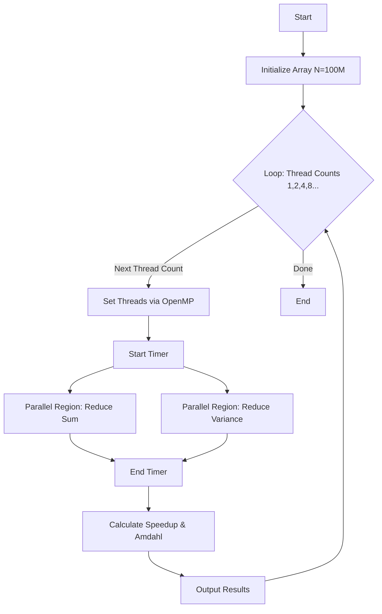
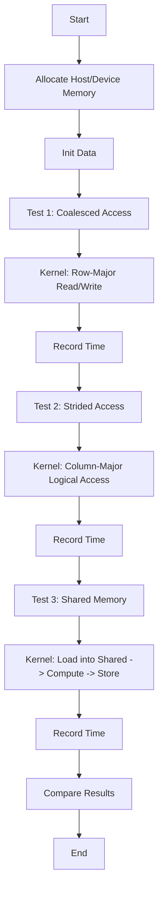
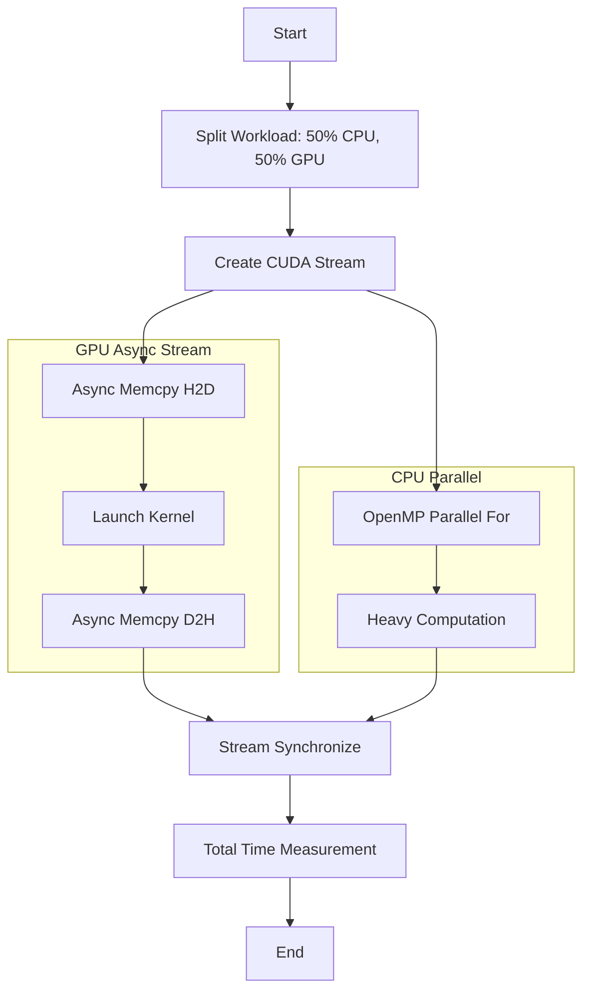
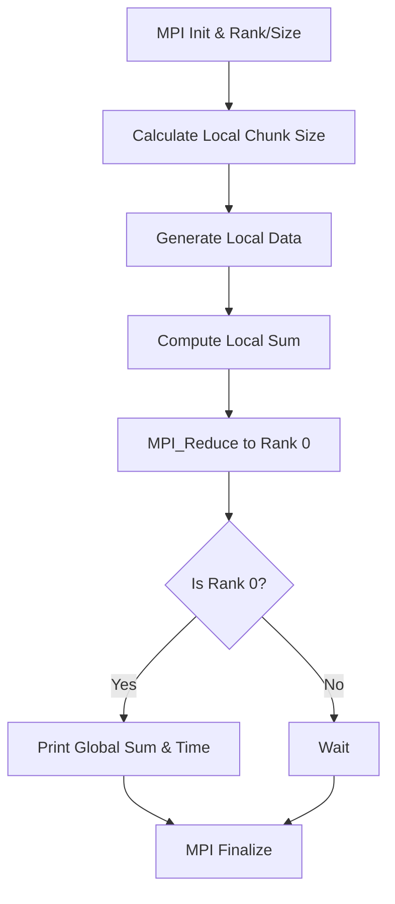

# Практическая работа №10. Гетерогенное параллельное программирование

## Описание
Данная работа посвящена анализу производительности и оптимизации параллельных программ с использованием OpenMP, CUDA и MPI.

## Содержание
1. [Задание 1: OpenMP Анализ производительности](#задание-1-анализ-производительности-cpu-параллельной-программы-openmp)
2. [Задание 2: CUDA Оптимизация памяти](#задание-2-оптимизация-доступа-к-памяти-на-gpu-cuda)
3. [Задание 3: Гибридное приложение CPU+GPU](#задание-3-профилирование-гибридного-приложения-cpu--gpu)
4. [Задание 4: MPI Распределенные вычисления](#задание-4-анализ-масштабируемости-распределённой-программы-mpi)
5. [Контрольные вопросы](#контрольные-вопросы)

---

## Задание 1. Анализ производительности CPU-параллельной программы (OpenMP)

Программа реализует параллельное вычисление суммы, среднего значения и дисперсии большого массива данных.
Выполняется замер времени для разного числа потоков и расчет ускорения.

### Компиляция и запуск
```bash
g++ -fopenmp task1_openmp.cpp -o task1_openmp
./task1_openmp
```

### Flowchart (Algorithm)


---

## Задание 2. Оптимизация доступа к памяти на GPU (CUDA)

Исследование влияния паттернов доступа к памяти (Coalesced vs Strided) на производительность GPU.
Также реализована оптимизация с использованием Shared Memory.

### Компиляция и запуск
```bash
nvcc task2_cuda_memory.cu -o task2_cuda_memory
./task2_cuda_memory
```

### Flowchart


---

## Задание 3. Профилирование гибридного приложения CPU + GPU

Гибридная программа, разделяющая нагрузку между CPU (OpenMP) и GPU (CUDA).
Используются CUDA Streams для асинхронной передачи данных и выполнения ядер параллельно с работой CPU.

### Компиляция и запуск
```bash
nvcc -Xcompiler -fopenmp task3_hybrid.cu -o task3_hybrid
./task3_hybrid
```

### Flowchart


---

## Задание 4. Анализ масштабируемости распределённой программы (MPI)

MPI программа для вычисления суммы распределенного массива.
Демонстрирует использование `MPI_Reduce` и замер времени выполнения.

### Компиляция и запуск
```bash
mpic++ task4_mpi.cpp -o task4_mpi
mpiexec -n 4 task4_mpi
```

### Flowchart


---

## Контрольные вопросы

### 1. В чём отличие измерения времени выполнения от профилирования?
**Измерение времени (Benchmarking)** — это фиксация общего времени выполнения программы или её частей (wall-clock time), которая отвечает на вопрос "Как долго работает код?".
**Профилирование (Profiling)** — это детальный анализ работы программы, который показывает, *где именно* тратится время, как используются ресурсы (CPU, GPU, память, кэш), сколько раз вызываются функции (Call Graph) и где находятся "узкие места".

### 2. Какие виды узких мест характерны для CPU, GPU и распределённых программ?
*   **CPU:**
    *   False Sharing (ложное разделение кэш-линий).
    *   Неэффективное использование кэша (cache miss).
    *   Зависимости по данным, мешающие векторизации.
    *   Накладные расходы на создание потоков (Thread overhead).
*   **GPU:**
    *   Bandwidth bound (упор в пропускную способность памяти - некоалесцированный доступ).
    *   Latency bound (задержки доступа, недостаточно активных варпов для скрытия задержек).
    *   Compute bound (упор в вычислительную мощность ядер).
    *   Warp Divergence (расхождение нитей внутри варпа).
    *   Накладные расходы PCI-E передачи (CPU-GPU).
*   **Распределённые (MPI):**
    *   Communication overhead (время передачи сообщений по сети).
    *   Load imbalance (дисбаланс нагрузки: одни процессы ждут другие).
    *   Latency (сетевая задержка при частых мелких сообщениях).

### 3. Почему увеличение числа потоков или процессов не всегда приводит к ускорению?
*   **Закон Амдала:** Последовательная часть программы ограничивает максимальное ускорение.
*   **Накладные расходы:** Создание потоков, синхронизация и коммуникация требуют времени. Если задача слишком мала, эти расходы превышают выигрыш от параллелизма.
*   **Конкуренция за ресурсы:** Потоки могут конкурировать за кэш, память или шину данных, вызывая деградацию производительности.

### 4. Как законы Амдала и Густафсона применяются при анализе масштабируемости?
*   **Закон Амдала (Strong Scaling):** Оценивает ускорение при *фиксированном* размере задачи. Показывает предел ускорения при увеличении числа процессоров. Если есть 5% последовательного кода, ускорение никогда не превысит 20x.
*   **Закон Густафсона (Weak Scaling):** Оценивает ускорение при увеличении размера задачи *пропорционально* числу процессоров. Предполагает, что при увеличении ресурсов мы решаем бóльшую задачу за то же время. Позволяет достичь почти линейного ускорения для масштабируемых задач.

### 5. Какие факторы наиболее критичны для производительности гибридных приложений?
*   **Балансировка нагрузки:** Равномерное распределение работы между CPU и GPU, учитывая их разную производительность.
*   **Минимизация передачи данных:** PCI-E шина медленная по сравнению с памятью устройства. Необходимо минимизировать пересылки H2D/D2H.
*   **Перекрытие (Overlapping):** Использование асинхронных операций (Streams) для одновременного выполнения вычислений на GPU, CPU и передачи данных.
