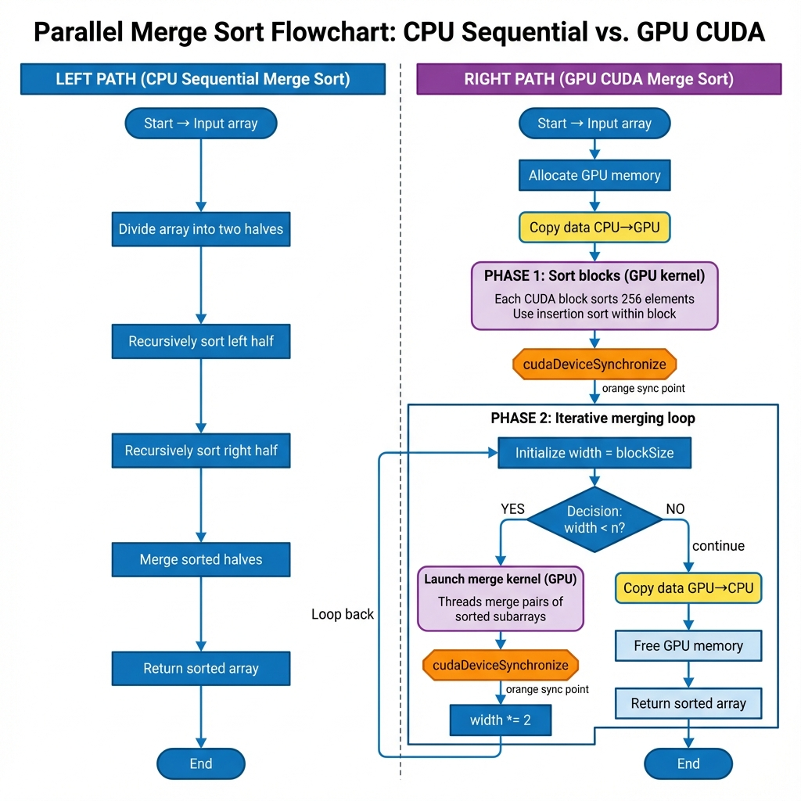
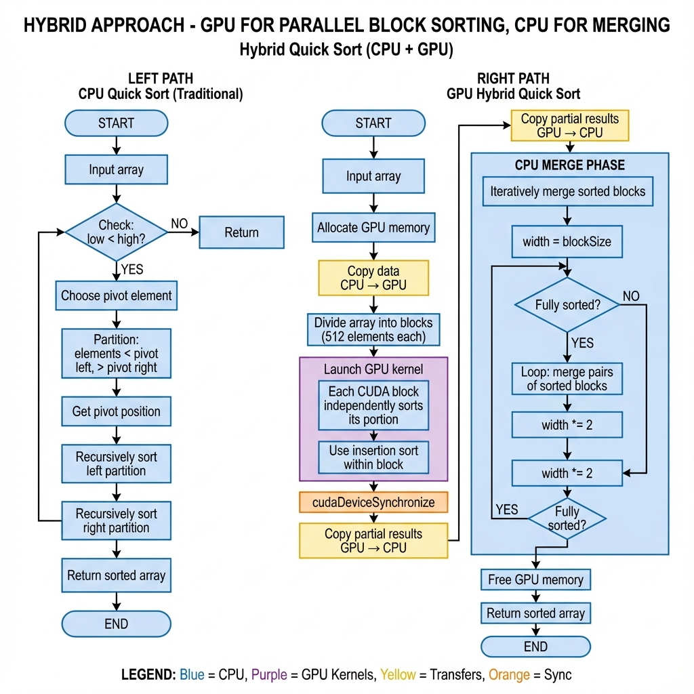
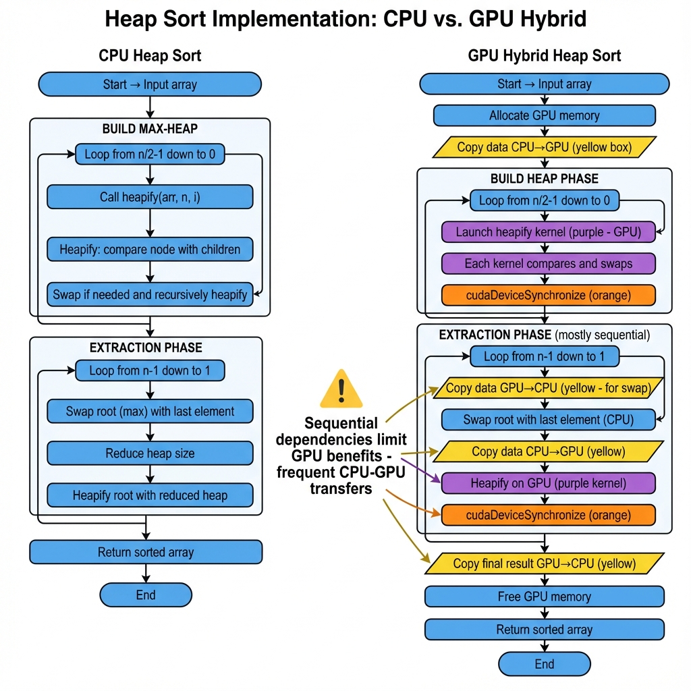

# Practice 3: Параллельные алгоритмы сортировки на CUDA

Эта практическая работа демонстрирует реализацию трех различных алгоритмов сортировки на CUDA с сравнением производительности GPU и CPU версий.

## Структура проекта

- [merge_sort.cu](file:///c:/Users/Aibol/Desktop/AITU/2nd%20course/2nd%20trimester/heterogeneous-parallelization/practice3/merge_sort.cu): Параллельная сортировка слиянием
- [quick_sort.cu](file:///c:/Users/Aibol/Desktop/AITU/2nd%20course/2nd%20trimester/heterogeneous-parallelization/practice3/quick_sort.cu): Гибридная быстрая сортировка
- [heap_sort.cu](file:///c:/Users/Aibol/Desktop/AITU/2nd%20course/2nd%20trimester/heterogeneous-parallelization/practice3/heap_sort.cu): Пирамидальная сортировка
- `README.md`: Этот файл

## Требования

- **NVIDIA CUDA Toolkit** - [Скачать здесь](https://developer.nvidia.com/cuda-downloads)
- **NVIDIA GPU** (GTX, RTX, Tesla series)
- **Visual Studio Build Tools** (для Windows) с C++ компилятором
- **Компилятор C++** с поддержкой CUDA

## Компиляция

### Для Windows (Developer Command Prompt for VS):

```bash
# Сортировка слиянием
nvcc merge_sort.cu -o merge_sort.exe

# Быстрая сортировка
nvcc quick_sort.cu -o quick_sort.exe

# Пирамидальная сортировка
nvcc heap_sort.cu -o heap_sort.exe
```

### Для Linux:

```bash
nvcc merge_sort.cu -o merge_sort
nvcc quick_sort.cu -o quick_sort
nvcc heap_sort.cu -o heap_sort
```

## Запуск

```bash
./merge_sort
./quick_sort
./heap_sort
```

---

## Описание алгоритмов

### 1. Сортировка слиянием (Merge Sort)



**Принцип работы:**
- Разделяет массив на две половины
- Рекурсивно сортирует каждую половину
- Сливает отсортированные половины

**GPU реализация:**
1. Делит массив на блоки по 256 элементов
2. Каждый CUDA блок сортирует свою часть (insertion sort)
3. Итеративно сливает отсортированные блоки параллельно

**Временная сложность:** O(n log n)  
**Пространственная сложность:** O(n)

**Параллелизуемость:** ⭐⭐⭐⭐⭐ Отлично
- Слияние подмассивов легко параллелится
- Нет зависимостей между независимыми слияниями
- Хорошо подходит для GPU архитектуры

---

### 2. Быстрая сортировка (Quick Sort)



**Принцип работы:**
- Выбирает опорный элемент (pivot)
- Разделяет массив: элементы меньше pivot слева, больше - справа
- Рекурсивно сортирует левую и правую части

**GPU реализация (Гибридный подход):**
1. Делит массив на блоки
2. GPU сортирует каждый блок независимо
3. CPU выполняет финальное слияние блоков

**Временная сложность:** 
- Средняя: O(n log n)
- Худшая: O(n²)

**Пространственная сложность:** O(log n)

**Параллелизуемость:** ⭐⭐⭐ Средняя
- Шаг partition трудно эффективно распараллелить
- Рекурсия плохо подходит для GPU
- Требует сложная синхронизация между потоками
- Гибридный подход более практичен

---

### 3. Пирамидальная сортировка (Heap Sort)



**Принцип работы:**
- Строит max-heap из массива
- Извлекает максимальный элемент (корень кучи)
- Восстанавливает свойство кучи
- Повторяет до полной сортировки

**GPU реализация:**
1. Строит heap с помощью CUDA ядер
2. Извлекает элементы с частичной GPU обработкой
3. Использует CPU для операций swap из-за зависимостей

**Временная сложность:** O(n log n)  
**Пространственная сложность:** O(1)

**Параллелизуемость:** ⭐⭐ Низкая
- Сильные последовательные зависимости
- Каждый шаг extraction depends on предыдущего
- Частые CPU-GPU transfers замедляют работу
- Не оптимальна для GPU

---

## Сравнение производительности

### Ожидаемые результаты

| Алгоритм | Малые массивы (10K) | Средние (100K) | Большие (1M) | GPU Преимущество |
|----------|---------------------|----------------|--------------|------------------|
| **Merge Sort** | CPU быстрее | GPU ~2x быстрее | GPU ~5-10x быстрее | ⭐⭐⭐⭐⭐ |
| **Quick Sort** | CPU быстрее | GPU ~1.5x быстрее | GPU ~3x быстрее | ⭐⭐⭐ |
| **Heap Sort** | CPU быстрее | CPU быстрее | GPU ~1x (равны) | ⭐ |

### Факторы, влияющие на производительность

1. **Размер массива**
   - Малые массивы: накладные расходы GPU превышают выгоду
   - Большие массивы: параллелизм GPU дает значительное ускорение

2. **Передача данных CPU↔GPU**
   - Копирование данных занимает время
   - Критично для алгоритмов с частыми transfers

3. **Параллелизуемость алгоритма**
   - Merge sort: естественно параллелится
   - Quick sort: требует синхронизации
   - Heap sort: много последовательных зависимостей

4. **GPU архитектура**
   - Количество SM (Streaming Multiprocessors)
   - Объем глобальной памяти
   - Пропускная способность памяти

---

## Выводы

### Лучшие практики для GPU сортировки:

1. **Merge Sort** - оптимальный выбор для GPU
   - Предсказуемые паттерны доступа к памяти
   - Отличная параллелизуемость
   - Стабильная производительность

2. **Quick Sort** - требует гибридного подхода
   - Классический quicksort плохо параллелится на GPU
   - Эффективны гибридные варианты
   - Альтернатива: Radix sort для целых чисел

3. **Heap Sort** - не рекомендуется для GPU
   - Последовательные зависимости
   - Сложный паттерн доступа к памяти
   - CPU версия часто быстрее

### Рекомендации:

- Для общей сортировки на GPU: **Merge Sort** или **Radix Sort**
- Для малых массивов (< 10K): используйте CPU
- Для гибридных систем: комбинируйте GPU и CPU сильные стороны
- Минимизируйте CPU-GPU data transfers
- Профилируйте код для вашей конкретной GPU

---

## Дополнительные ресурсы

- [NVIDIA CUDA Programming Guide](https://docs.nvidia.com/cuda/cuda-c-programming-guide/)
- [Thrust Library](https://docs.nvidia.com/cuda/thrust/) - готовые параллельные алгоритмы
- [CUB Library](https://nvlabs.github.io/cub/) - оптимизированные GPU примитивы
- [GPU Gems 2: Chapter 46 - Improved GPU Sorting](https://developer.nvidia.com/gpugems/gpugems2/part-vi-simulation-and-numerical-algorithms/chapter-46-improved-gpu-sorting)

---

## Примечания

- Эти реализации созданы для образовательных целей
- Production код должен использовать оптимизированные библиотеки (Thrust, CUB)
- Производительность зависит от конкретной GPU модели
- Результаты могут варьироваться в зависимости от системы
