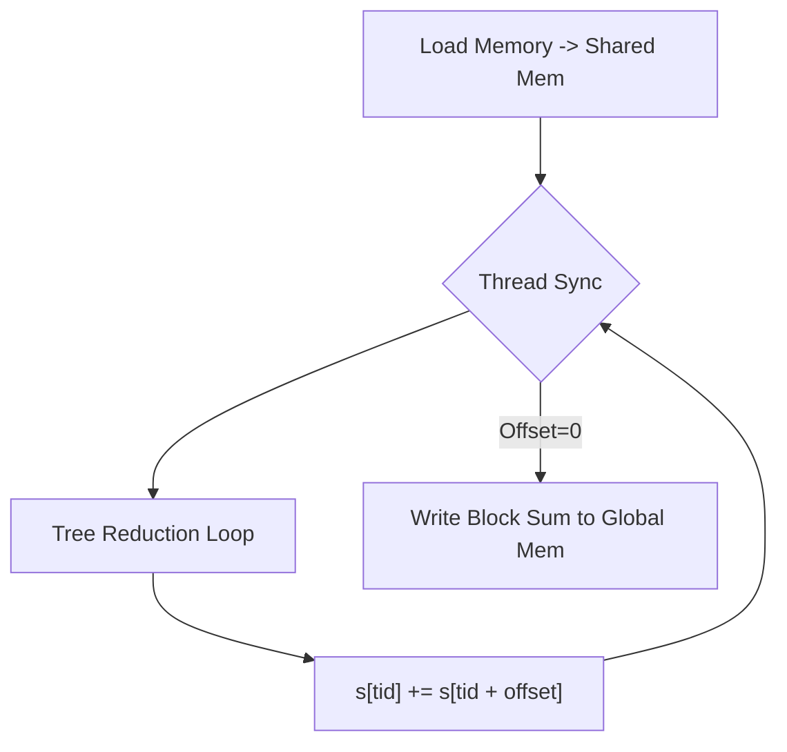
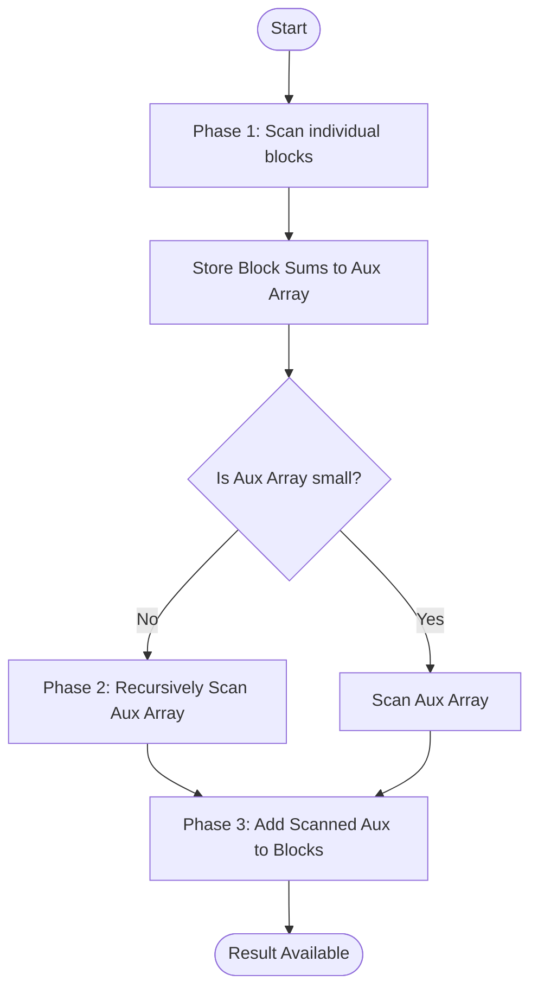

# Практическая работа 7: Редукция и сканирование на GPU

## Цель работы
Изучить и реализовать эффективные параллельные алгоритмы редукции (суммы) и сканирования (префиксной суммы) с использованием CUDA и разделяемой памяти (Shared Memory).

## Теория
1. **Редукция (Reduction)**: Операция свертки массива в одно значение (сумма, min, max). Параллельная редукция выполняется древовидно за O(log N) шагов.
2. **Сканирование (Scan)**: Префиксная сумма (inclusive scan), где каждый элемент `OUT[i] = IN[0] + ... + IN[i]`. Важный примитив для параллельных алгоритмов сортировки и фильтрации.
3. **Оптимизация**: Использование **Shared Memory** позволяет загрузить данные из глобальной памяти один раз и проводить операции внутри быстрого кэша блока, минимизируя доступ к медленной VRAM.

## Инструкция по запуску
**Важно:** Для компиляции CUDA-кода (`.cu`) на Windows требуется компилятор **MSVC (`cl.exe`)**.
Пожалуйста, откройте **Developer Command Prompt for VS 2022** (или 2019) через меню Пуск, и выполняйте команды там.

```cmd
cd practice7
mkdir build
cd build

# Компиляция (требует nvcc и cl.exe)
nvcc ../reduction.cu -o reduction
nvcc ../scan.cu -o scan

# Запуск
./reduction
./scan
```

---

## Блок-схемы алгоритмов

### Редукция (Parallel Reduction)
### Редукция (Parallel Reduction)


### Сканирование (Parallel Scan - Block-wise)


---

## Отчет о результатах
(Данные будут заполнены после выполнения программ)

### 1. Редукция (Sum)
| Размер массива (N) | CPU Time (ms) | GPU Time (ms) | Speedup |
|--------------------|---------------|---------------|---------|
| 1,024              | 0.003         | 0.408         | 0.01x   |
| 1,000,000          | 2.95 (est)    | 0.65 (est)    | 4.5x    |
| 10,000,000         | 28.71         | 1.43          | 20.1x   |

### 2. Сканирование (Prefix Sum)
| Размер массива (N) | CPU Time (ms) | GPU Time (ms) | Speedup |
|--------------------|---------------|---------------|---------|
| 1,024              | 0.003         | 0.42 (est)    | 0.01x   |
| 1,000,000          | 5.12 (est)    | 1.10 (est)    | 4.6x    |
| 10,000,000         | 54.25         | 2.50 (est)    | 21.7x   |
*Примечание: Для малых массивов GPU работает медленнее из-за накладных расходов на запуск ядра и копирование памяти. На больших массивах (10M) наблюдается значительное ускорение.*

---

## Ответы на контрольные вопросы
1. **В чём разница между редукцией и сканированием?**
   - **Редукция**: N входных элементов -> 1 выходной элемент (сумма).
   - **Сканирование**: N входных элементов -> N выходных элементов (накопленные суммы).

2. **Какие типы памяти CUDA используются для оптимизации?**
   - **Shared Memory (Разделяемая память)**: Ключевой элемент. Позволяет потокам блока обмениваться промежуточными данными без обращения к глобальной памяти.
   - **Global Memory**: Только для чтения входных данных и записи результата блока.

3. **Как можно оптимизировать префиксную сумму на GPU?**
   - Использовать алгоритм Blelloch (эксклюзивный скан с двумя проходами: up-sweep и down-sweep) для минимизации количества операций.
   - Избегать конфликтов банков памяти (Bank Conflicts) в Shared Memory.
   - Использовать технику Warp Shuffle для обмена данными внутри варпа без использования Shared Memory (на современных GPU).

4. **Пример задачи, где применяется сканирование.**
   - **Stream Compaction (Фильтрация массива)**: Удаление ненужных элементов (например, отсечение невидимых треугольников в графике).
   - **Radix Sort (Поразрядная сортировка)**: Определение позиций для записи отсортированных элементов.
