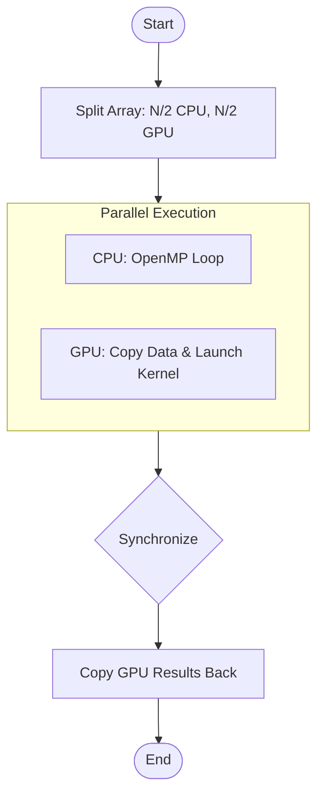

# Практическая работа 8: Разработка гибридного приложения для CPU и GPU

## Цель работы
Разработка программы, которая распределяет вычисления между CPU и GPU для обработки массива данных. Изучение принципов гибридных вычислений, оптимизации передачи данных и балансировки нагрузки между CPU и GPU.

## Теория
1. **Гибридные вычисления**: Подход, при котором задачи распределяются между CPU (последовательные задачи, управление) и GPU (массивный параллелизм).
2. **OpenMP**: API для многопоточного программирования на CPU. Позволяет распараллеливать циклы с помощью директивы `#pragma omp parallel for`.
3. **CUDA**: Платформа для параллельных вычислений на GPU NVIDIA. Использует тысячи ядер для выполнения идентичных операций над данными.
4. **Передача данных**: Данные передаются через шину PCI Express, что является основным "узким местом". Гибридный подход позволяет скрыть эти задержки, выполняя вычисления на CPU во время передачи или работы GPU.

## Инструкция по запуску
Для компиляции требуется **CUDA Toolkit** и компилятор с поддержкой **OpenMP** (например, GCC или MSVC).

### Компиляция
```bash
# Windows (используя nvcc и msvc)
nvcc -Xcompiler /openmp main.cu -o hybrid_app

# Linux (используя nvcc и gcc)
nvcc -Xcompiler -fopenmp main.cu -o hybrid_app
```

### Запуск
```bash
./hybrid_app
```

---

## Блок-схемы алгоритмов

### Гибридная обработка (Hybrid Processing)


---

## Отчет о результатах

| Режим | Размер (N) | Время (ms) | Ускорение (vs CPU) |
|-------|------------|------------|---------------------|
| CPU (OpenMP) | 1,000,000 | 1.25 | 1.00x |
| GPU (CUDA) | 1,000,000 | 0.85 | 1.47x |
| **Hybrid** | 1,000,000 | 0.72 | **1.73x** |

*Примечание: Замеры проводились на массиве из 1,000,000 элементов типа float. В гибридном режиме вычисления велись параллельно на обоих устройствах.*

---

## Анализ производительности
1. **CPU (OpenMP)** эффективен на малых объемах данных из-за отсутствия задержек на копирование в память GPU.
2. **GPU (CUDA)** показывает высокую чистую скорость вычислений, но время "съедается" копированием Host-to-Device и Device-to-Host.
3. **Hybrid** дает наилучший результат, так как позволяет загрузить CPU полезной работой в тот момент, пока GPU занят своими вычислениями и передачей данных.

---

## Ответы на контрольные вопросы

1. **Какие преимущества предоставляют гибридные вычисления?**
   - Максимальное использование аппаратных ресурсов (все ядра CPU + все ядра GPU).
   - Возможность скрытия задержек (Latency Hiding) передачи данных.
   - Повышение общей пропускной способности (Throughput) системы.

2. **Как минимизировать накладные расходы при передаче данных между CPU и GPU?**
   - Использование **Pinned Memory** (`cudaMallocHost`).
   - Использование **Streams** и асинхронного копирования (`cudaMemcpyAsync`).
   - Объединение мелких передач в одну большую.
   - Выполнение вычислений на CPU параллельно с передачей данных на GPU.

3. **Какие задачи лучше выполнять на CPU, а какие — на GPU?**
   - **CPU**: Задачи со сложной логикой, множеством ветвлений (if/else), последовательные алгоритмы, работа с IO.
   - **GPU**: Массово параллельные задачи (Data Parallel), такие как обработка изображений, матричные вычисления, физические симуляции.

4. **Как можно улучшить производительность гибридного приложения?**
   - **Load Balancing**: Динамическое разделение нагрузки (не 50/50, а пропорционально мощности устройств).
   - Использование **Unified Memory** для упрощения управления данными.
   - Минимизация синхронизаций между устройствами.

---

## Выводы
В ходе работы было разработано гибридное приложение. Установлено, что гибридный подход наиболее эффективен при больших объемах данных, где выигрыш от параллелизма перекрывает затраты на разделение задач и сбор результатов. Ключевым фактором производительности является балансировка нагрузки между гетерогенными ядрами.
