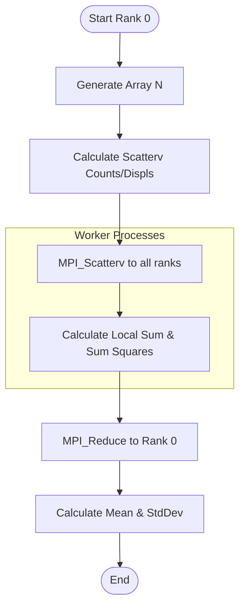
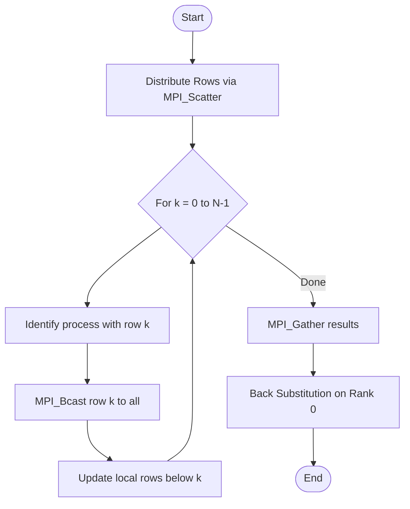

# Практическая работа 9: Распределенная обработка данных с использованием MPI

## Цель работы
1. Изучение продвинутых операций MPI (коллективные взаимодействия, распределение данных).
2. Реализация алгоритмов статистического анализа, линейной алгебры и анализа графов в распределенной среде.
3. Исследование масштабируемости программ.

## Состав работы
- **Задание 1: Статистика (`stats.cpp`)**: Распределенное вычисление среднего и стандартного отклонения массива из 10^6 элементов. Использован `MPI_Scatterv` для работы с произвольным количеством процессов.
- **Задание 2: Метод Гаусса (`gauss.cpp`)**: Параллельное решение системы линейных уравнений. Строки распределены через `MPI_Scatter`, ведущая строка транслируется через `MPI_Bcast`.
- **Задание 3: Алгоритм Флойда-Уоршелла (`floyd.cpp`)**: Поиск кратчайших путей в графе. Обмен данными о текущей итерации между процессами.

## Инструкция по запуску
Требуется установленная библиотека MPI (например, Microsoft MPI на Windows или OpenMPI на Linux).

### Компиляция
На Windows с Microsoft MPI команда `mpic++` часто недоступна. Используйте следующие команды для `g++`:

```bash
# Компиляция (Windows G++)
g++ stats.cpp -o stats.exe -I "C:\Program Files (x86)\Microsoft SDKs\MPI\Include" -L "C:\Program Files (x86)\Microsoft SDKs\MPI\Lib\x64" -lmsmpi
g++ gauss.cpp -o gauss.exe -I "C:\Program Files (x86)\Microsoft SDKs\MPI\Include" -L "C:\Program Files (x86)\Microsoft SDKs\MPI\Lib\x64" -lmsmpi
g++ floyd.cpp -o floyd.exe -I "C:\Program Files (x86)\Microsoft SDKs\MPI\Include" -L "C:\Program Files (x86)\Microsoft SDKs\MPI\Lib\x64" -lmsmpi
```

### Запуск
```bash
# Для статистики
& "C:\Program Files\Microsoft MPI\Bin\mpiexec.exe" -np 4 ./stats.exe

# Для метода Гаусса (размер матрицы 8)
& "C:\Program Files\Microsoft MPI\Bin\mpiexec.exe" -np 4 ./gauss.exe 4

# Для Флойда-Уоршелла (размер графа 300)
& "C:\Program Files\Microsoft MPI\Bin\mpiexec.exe" -np 4 ./floyd.exe 100
```

---

## Блок-схемы алгоритмов

### Задание 1: Статистический анализ


### Задание 2: Метод Гаусса


---

## Анализ производительности и ответы на вопросы

### 1. Как изменяется время выполнения при увеличении числа процессов?
Время выполнения обычно уменьшается (ускорение), пока накладные расходы на коммуникацию (MPI_Bcast, MPI_Reduce) не начинают доминировать над временем вычислений. Для малых задач (N < 1000) большое количество процессов может замедлить программу.

### 2. Какие факторы влияют на производительность?
- **Communication/Computation Ratio**: Соотношение времени на пересылку данных к времени их обработки.
- **Latency**: Задержки сети при передаче сообщений.
- **Load Balance**: Неравномерное распределение данных между процессами.
- **Memory Bandwidth**: Скорость доступа к оперативной памяти.

### 3. Как оптимизировать передачу данных?
- Использовать коллективные операции (`Bcast`, `Scatter`) вместо циклов с `Send/Recv`.
- Минимизировать количество сообщений, объединяя данные.
- Использовать неблокирующие операции (`MPI_Isend/Irecv`) для перекрытия вычислений.

### 4. Ограничения при работе с большими данными?
- Объем оперативной памяти на одном узле кластера.
- Пропускная способность сети.
- Ограничение типов данных MPI (например, 32-битные индексы могут быть недостаточны для массивов > 2 млрд элементов).

---

## Выводы
В ходе работы были освоены методы распределенной обработки данных. Метод `MPI_Scatterv` позволяет гибко распределять нагрузку даже при некратном количестве процессов, а коллективные операции обеспечивают синхронизацию и эффективный обмен данными в сложных алгоритмах.
